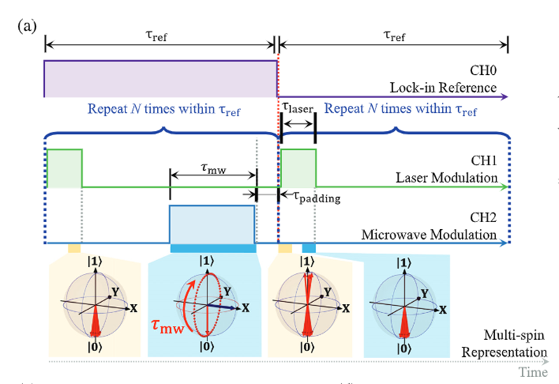

# MW and LASER pulsing
The goal of the code is to sync the microwave relay and laser with the laser driver to created Rabi oscillations like in Figure 23. 
Figure 23, Rabi oscillations diagram

In figure 23, the behaviour of the microwave and laser is described. The important constant parameters are the length of the period (2.5 ms), τ-padding (1 μs), and τ-laser (5 μs). The length of the τ-microwave is variable. To change the Microwave pulse width, change the float value of the following variable in the code: 
//changes these value to manipulate the Rabi oscillation.

const float tmw = 1000.0f; //in Micro seconde 

On/off time is calculated in the following way:
* const float MicroWaveOffTime = (PeriodTime * 1000) - delayEndTime - tmw;
* const float MicroWaveOnTime = (PeriodTime * 1000) - delayEndTime - MicroWaveOffTime;

The off time is the period time in microseconds minus the end time and on time. The on time is the period Time in microseconds minus the end time and off time. 
Interrupt service routine is called by a simple interrupt timer without a prescaler. Look at Appendix B: Rabi oscillations code for the timer setup. The time in between actions is controlled by the delays. In the comments of the code is explained how to calculate and set up the timer period time. 
 
Software development tools
The code in Appendix B: Rabi oscillations code has been developed with the following software tools:
* 	Github: https://github.com/nianluisman/Rabi_ocilation_test
*	Visual code 2022
*	Platform IO.
*	arm-none-eabi GCC 9.2 (default compiler used by platform IO at the moment of writing)
*	Hardware settings:
*	platform = atmelavr
*	board = ATmega328P
*	framework = Arduino

## background info 

The ODMR (Optically Detected Magnetic Resonance) is used for manipulating the spin state of electrons in NV-centres in diamond. Being able to control and read out these spin states is critical for quantum computing. One way to prove one can manipulate these spin states, is by reproducing and detecting rabi oscillations. For this, the setup had to be converted from a continuous-wave ODMR setup to a pulsed-wave ODMR setup.

## overview setup  
 

